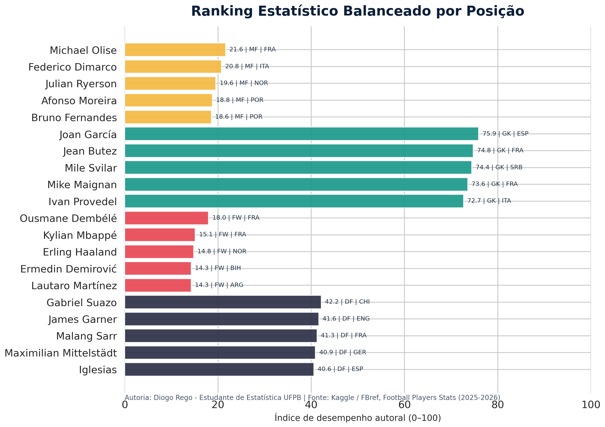

# Simulação de Monte Carlo para Escolha Estatística de Jogadores — Copa do Mundo 2026


**Autor:** Diogo Rego - Estudante de Estatística UFPB  
**Tema:** análise estatística aplicada ao futebol, seleção de jogadores e incerteza de desempenho.  
**Aplicação principal:** dashboard interativo em **R/Shiny** com simulação de **Monte Carlo** para estimar probabilidades relativas de escolha de jogadores em um elenco hipotético para a **Copa do Mundo 2026**.

> Este projeto foi desenvolvido como uma aplicação estatística autoral, com foco em reprodutibilidade, clareza metodológica, controle de qualidade de código e apresentação profissional dos resultados. O modelo não representa decisão oficial de seleção, convocação real ou previsão determinística; ele oferece uma leitura quantitativa, transparente e ajustável a partir das estatísticas disponíveis.



## Visão geral

O projeto constrói um fluxo completo de ciência de dados em **R**, partindo de estatísticas reais de jogadores da temporada **2025-2026**, tratando variáveis de desempenho por 90 minutos, calculando subíndices por função esportiva e aplicando uma simulação de Monte Carlo para incorporar incerteza estatística. A aplicação Shiny permite escolher uma nacionalidade, definir composição do elenco, ajustar pesos do índice e visualizar probabilidades de seleção com gráficos interativos e tabela analítica.

A base utilizada é o conjunto público **Football Players Stats (2025-2026)**, publicado no Kaggle por **Hubert Sidorowicz**, com estatísticas derivadas do **FBref** e licença MIT.[^1] O projeto mantém a fonte dos dados documentada nos metadados, no dicionário de dados e na interface da aplicação.

## Objetivo estatístico

O objetivo central é transformar estatísticas observadas de desempenho em uma estrutura probabilística de apoio à escolha de jogadores. Para isso, o projeto utiliza um **índice autoral de desempenho** em escala de 0 a 100 e uma simulação Monte Carlo que perturba esse índice de acordo com a incerteza individual de cada atleta.

| Dimensão | Descrição | Papel no modelo |
|---|---|---|
| Desempenho ofensivo | Gols, assistências, participação em gols, finalizações e eficiência. | Prioriza atacantes e jogadores de maior impacto ofensivo. |
| Criação e meio-campo | Assistências, cruzamentos, faltas sofridas, volume e ações defensivas complementares. | Diferencia jogadores de construção, criação e equilíbrio. |
| Desempenho defensivo | Desarmes vencidos, interceptações, disciplina, volume e experiência. | Classifica defensores por contribuição sem bola e consistência. |
| Goleiros | Percentual de defesas, jogos sem sofrer gols, gols sofridos por 90 minutos e minutos. | Avalia desempenho específico de goleiros. |
| Incerteza | Função dos minutos jogados e da exposição estatística. | Aumenta a variabilidade para jogadores com menor amostra. |

## Metodologia resumida

A metodologia utiliza normalização por posição para reduzir comparações injustas entre funções esportivas distintas. Em seguida, calcula subíndices especializados para ataque, meio-campo, defesa e goleiro. Cada jogador recebe um índice base conforme sua posição principal, com penalização para baixa amostra de minutos. Na etapa Monte Carlo, cada simulação gera um escore aleatório individual ao redor do índice ajustado, com desvio-padrão proporcional à incerteza do jogador. O elenco é selecionado por posição em cada rodada, e a probabilidade final corresponde à frequência relativa de seleção.

| Etapa | Procedimento | Resultado esperado |
|---|---|---|
| Coleta | Uso do dataset público Kaggle/FBref da temporada 2025-2026. | Base bruta com estatísticas individuais. |
| Tratamento | Padronização de nomes, posições, nacionalidades, minutos e métricas por 90 minutos. | Base `players_world_cup_monte_carlo_ready.csv`. |
| Engenharia de atributos | Criação de subíndices ofensivo, criativo, defensivo e de goleiro. | Indicadores comparáveis por função. |
| Penalização amostral | Redução do índice para jogadores com poucos minutos. | Controle contra superestimação por amostra pequena. |
| Monte Carlo | Sorteios repetidos de desempenho com incerteza individual. | Probabilidade estimada de seleção. |
| Visualização | Dashboard Shiny com gráficos, ranking, filtros e exportação. | Leitura interativa e profissional dos resultados. |

## Estrutura do repositório

A organização do repositório segue um padrão profissional para projetos estatísticos reprodutíveis. Os dados brutos e processados ficam separados, as funções estatísticas são modularizadas, a documentação metodológica é mantida em `docs/` e o dashboard Shiny permanece no arquivo `app.R`.

| Caminho | Finalidade |
|---|---|
| `app.R` | Aplicação Shiny principal com interface, filtros, gráficos, tabelas e download dos resultados. |
| `R/monte_carlo.R` | Funções estatísticas reutilizáveis para validação, índice ajustado e simulação Monte Carlo. |
| `scripts/prepare_data.R` | Script em R para preparar a base tratada a partir do CSV bruto. |
| `scripts/prepare_data.py` | Script auxiliar em Python usado para gerar rapidamente a base processada no ambiente de desenvolvimento. |
| `scripts/create_preview.py` | Gera a imagem profissional usada no README. |
| `scripts/download_data.py` | Script auxiliar para baixar os dados públicos via KaggleHub quando disponível. |
| `scripts/inspect_dataset.py` | Inspeciona dimensões, colunas e amostras do conjunto real. |
| `scripts/validate_project.R` | Verifica arquivos obrigatórios, sintaxe R e consistência mínima dos dados processados. |
| `data/raw/` | Dados brutos provenientes da fonte pública. |
| `data/processed/` | Base limpa, metadados e ranking auxiliar. |
| `docs/dicionario_dados.md` | Dicionário de dados e descrição das variáveis. |
| `docs/validacao_visual.md` | Registro da validação visual da prévia gráfica. |
| `img/dashboard_preview.png` | Prévia visual do ranking estatístico balanceado por posição. |
| `www/style.css` | Estilo visual customizado do dashboard. |
| `install_packages.R` | Instala as dependências necessárias do projeto. |

## Como executar

Para executar o projeto localmente, é necessário ter o **R** instalado e acesso à internet para instalação dos pacotes. O dashboard foi organizado para funcionar como aplicação Shiny padrão, com `app.R` na raiz do repositório.

```r
source("install_packages.R")
shiny::runApp()
```

Caso deseje reconstruir a base processada a partir do arquivo bruto, execute:

```r
source("scripts/prepare_data.R")
```

Para validar a estrutura do projeto, a sintaxe dos scripts R e a consistência mínima da base processada, execute:

```r
source("scripts/validate_project.R")
```

## Principais funcionalidades do dashboard

A aplicação Shiny foi desenhada para permitir exploração estatística com alto controle do usuário. O painel lateral concentra os parâmetros do modelo, enquanto a área principal apresenta ranking, distribuição por posição, diagnóstico de incerteza e tabela exportável.

| Funcionalidade | Descrição |
|---|---|
| Filtro por nacionalidade | Permite simular uma seleção específica a partir do código de nacionalidade disponível na base. |
| Minutos mínimos | Controla a elegibilidade estatística, evitando comparação direta com jogadores de baixa exposição. |
| Número de simulações | Ajusta a precisão empírica da probabilidade Monte Carlo. |
| Fator de incerteza | Permite cenários mais conservadores ou mais voláteis. |
| Composição do elenco | Define vagas para goleiros, defensores, meio-campistas e atacantes. |
| Pesos do índice | Ajusta a importância relativa de ataque, criação, defesa e goleiro. |
| Exportação | Permite baixar o resultado completo da simulação em CSV. |

## Interpretação dos resultados

A probabilidade apresentada no dashboard é uma **frequência relativa simulada**. Se um jogador aparece com 72% de probabilidade, isso significa que ele foi selecionado em 72% das rodadas simuladas sob os parâmetros escolhidos. Alterar pesos, vagas por posição, minutos mínimos ou fator de incerteza pode modificar o ranking, o que é desejável em uma ferramenta de análise de sensibilidade.

| Faixa de probabilidade | Interpretação operacional |
|---|---|
| 80% a 100% | Favorito estatístico dentro do cenário configurado. |
| 55% a 79,99% | Forte candidato com desempenho competitivo. |
| 30% a 54,99% | Jogador competitivo, sensível aos pesos e restrições. |
| 10% a 29,99% | Aposta situacional ou dependente de cenário. |
| 0% a 9,99% | Baixa probabilidade no cenário atual. |

## Controle de qualidade

O projeto incorpora práticas de controle de qualidade em diferentes camadas. A base processada contém metadados de fonte e autoria, o código R possui validação de colunas obrigatórias, o índice é limitado ao intervalo 0–100, e o script `scripts/validate_project.R` verifica estrutura, sintaxe e consistência mínima dos dados.

| Controle | Implementação |
|---|---|
| Reprodutibilidade | Uso de semente configurável na simulação Monte Carlo. |
| Modularidade | Separação entre `app.R`, funções estatísticas e scripts de preparação. |
| Transparência | Dicionário de dados, metadados e metodologia documentada. |
| Robustez | Validação de colunas, limites de índice e tratamento de baixa amostra. |
| Comunicação | Gráficos interativos, tabela exportável e documentação em Markdown. |

## Limitações

O modelo depende exclusivamente das variáveis disponíveis no dataset utilizado. Ele não incorpora lesões, contexto tático de seleções nacionais, histórico internacional, critérios subjetivos de comissão técnica, qualidade dos adversários, scouts proprietários ou desempenho fora das ligas cobertas. Portanto, os resultados devem ser interpretados como **apoio estatístico exploratório**, e não como previsão oficial de convocação.

## Autoria

Este projeto, sua organização estatística, documentação aplicada, estrutura de análise e dashboard foram desenvolvidos sob a autoria de:

**Diogo Rego - Estudante de Estatística UFPB**

## Referências

[^1]: Hubert Sidorowicz. **Football Players Stats (2025-2026)**. Kaggle. Disponível em: <https://www.kaggle.com/datasets/hubertsidorowicz/football-players-stats-2025-2026>.
[^2]: FBref. **Football Statistics and History**. Disponível em: <https://fbref.com/>.
[^3]: Posit. **Shiny for R**. Disponível em: <https://shiny.posit.co/r/>.
